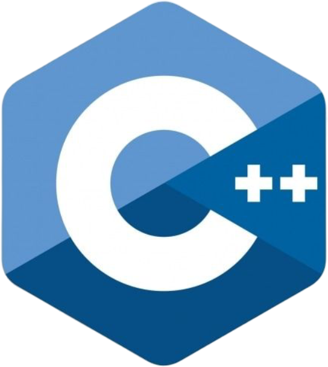

# Hi, my name is Andrey!
This file will tell you a little about me as a programmer!

## List of Favorite Programming Languages

<code></code>
<code></code>
<code></code>
<code></code>

## Some statistics

  

 

  

