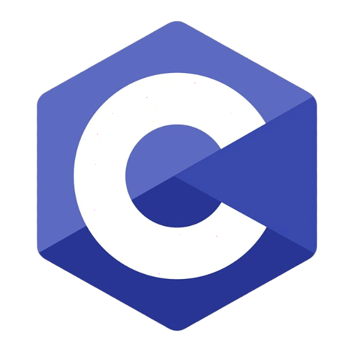
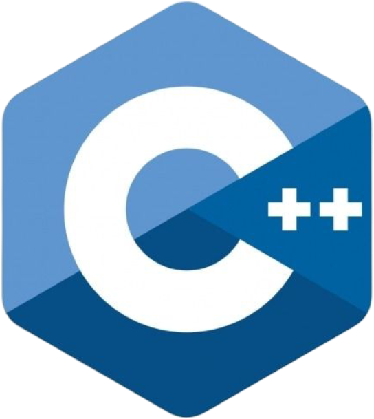

# Hi — I'm awsq.code (IHateGameDev) 👋

I'm a student learning programming and computer systems. I often dive deep into a project, then switch to something else, and come back later. I appreciate feedback, suggestions, and code reviews - feel free to reach out.
Now github store RO repos. For early edits and RW, visit [codeber](https://codeberg.com/awsq).

## About me 👀
- **Role:** Student
- **Style:** Experimental, prototype-first, minimal solutions
- **Work habit:** Enthusiastic but flighty — cycles between projects
- **Looking for:** Code reviews, collaboration, mentorship

## Favorite languages 💻

  <code></code>
  <code></code>
  <code></code>
  <code></code>

## Skills & tools 🛠️
- **Languages:** C, C++ (marked obsolete), Lua, Bash  
- **Tools:** Git, Make/CMake (marked obsolete), clang-*, xmake  
- **OS:** Linux (primary), Windows (as needed)
